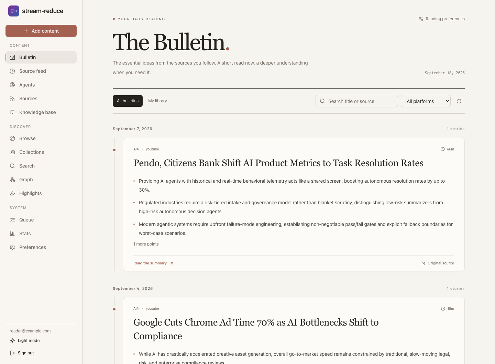
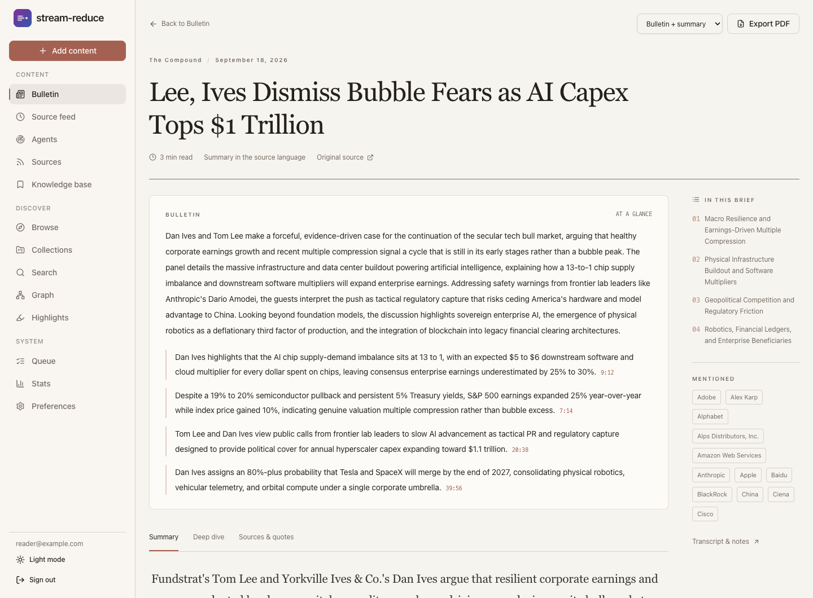
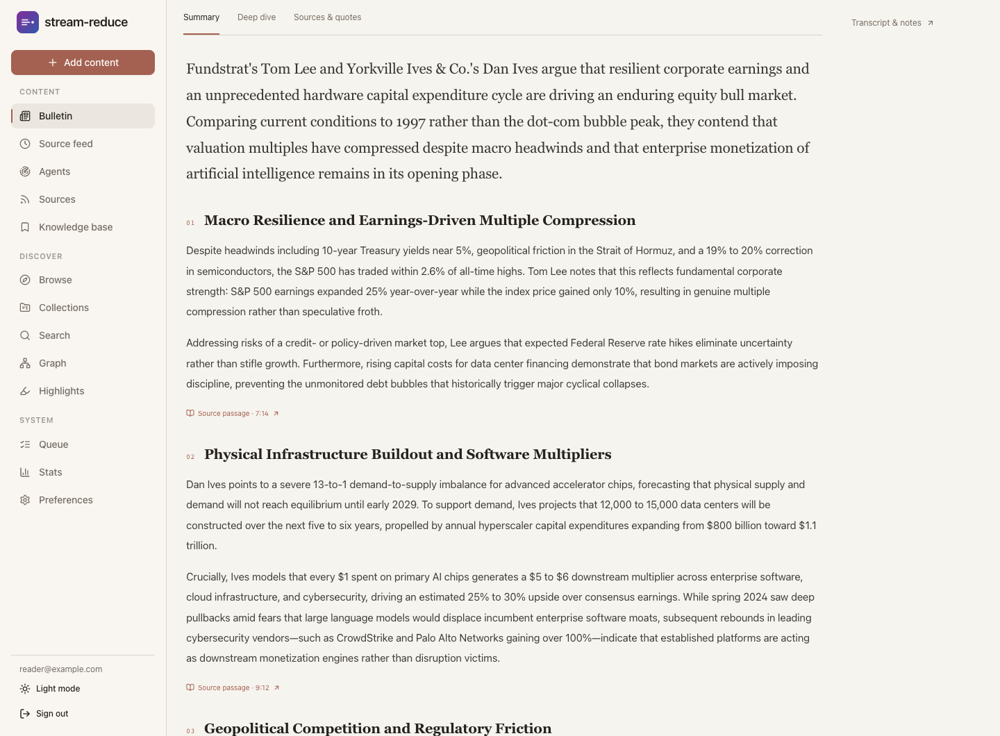
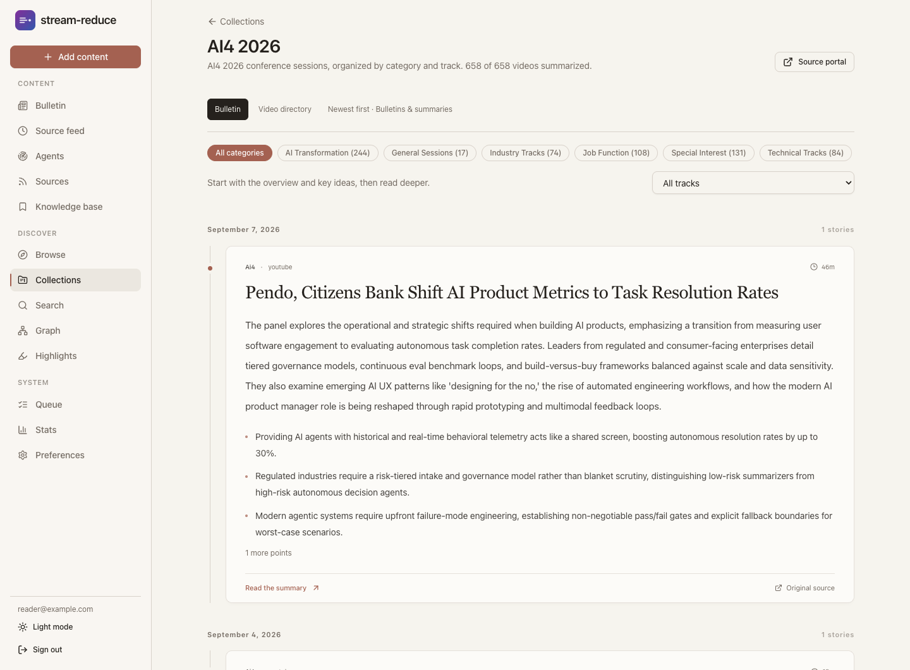
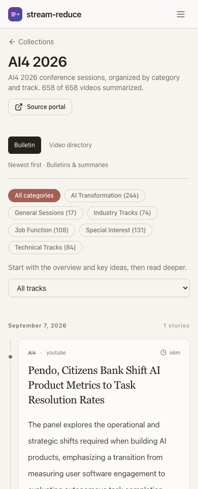
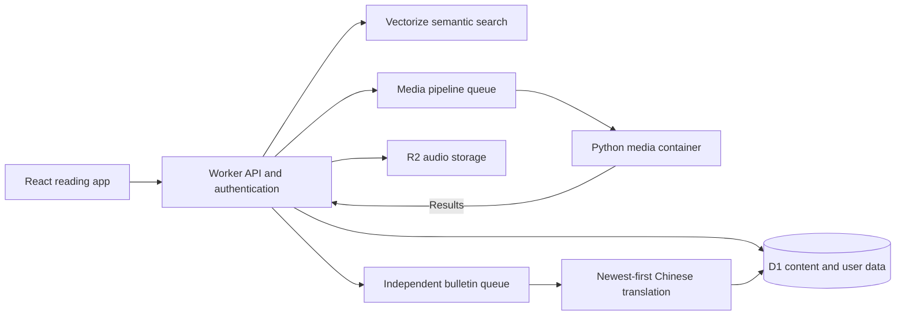

# Stream Reducer

**Turn videos and podcasts into source-linked bulletins, readable summaries, and a searchable knowledge base.**

[Open the app](https://reducer.xgoose.org) · [Explore collections](https://reducer.xgoose.org/collections) · [Cloudflare setup](cf/README.md) · [Self-hosting](docs/self-hosting.md)

Stream Reducer gives long-form media a reading interface. Follow the sources you
care about, scan their key ideas in a chronological Bulletin, and open a concise
reading summary when something deserves more attention. Detailed notes, quotes,
and timestamps keep the original source within reach.



## Start reading

1. **Explore without an account.** Browse [public collections](https://reducer.xgoose.org/collections), including [AI4 2026](https://reducer.xgoose.org/collections/ai4-2026?view=bulletin) and [AI4 2025](https://reducer.xgoose.org/collections/ai4-2025?view=bulletin).
2. **Sign in with an email magic link** to build your own library and follow sources.
3. **Add a URL or follow a channel.** Completed summaries appear in your Bulletin; source subscriptions check for new content automatically.
4. **Choose how deeply to read.** Scan the bulletin, open the reading summary, or switch to the full notes and source references.

Supported sources include **YouTube, Bilibili, Apple Podcasts, Xiaoyuzhou, and
RSS/RSSHub feeds**. Supported playlist and show URLs can add multiple episodes.

## A reading workflow for long-form media

### Scan the Bulletin, then read the summary

The Bulletin groups stories by date, with headline search, platform filters,
a saved-items view, and automatic loading as you scroll. Each story links to a
separate reading page with three views:

- **Summary:** a concise narrative organized around the source's main ideas.
- **Deep dive:** detailed notes for following the argument in full.
- **Sources & quotes:** excerpts, attribution, and links back to the source.

The reading page also includes a short bulletin, a section outline, and
**PDF export** through the browser's print dialog. Export the bulletin and
reading summary, or include the full notes.



<details>
<summary>See the second reading layer</summary>

A dedicated summary develops the ideas beyond the short bulletin, with source
passages alongside the relevant sections.



</details>

### Read an entire collection

Collections open in **Bulletin** view so you can read across a conference without
opening each video individually. Filter by category or track, browse from newest
to oldest, and switch to **Video directory** whenever you want the catalog.
Opening a summary preserves your collection filters when you return.



<details>
<summary>See the mobile collection view</summary>

The same reading flow adapts to narrow screens.



</details>

### Keep the source language, or choose Chinese bulletins

The default preference, **Auto · keep the source language**, preserves the
language of each source. English sources have English bulletins and reading
summaries. In **Preferences**, you can choose Simplified Chinese for the short
bulletin's title, subheading, overview, and key points.

Chinese bulletin backfill runs independently of media ingestion and selects
newer sources first. Detailed summaries and original notes retain their source
language.

### Find and connect what you have read

- **Personal library:** save, organize, favorite, and archive items; add comments and highlights.
- **Semantic search:** search transcript and summary passages by meaning, with source locations in the results.
- **Knowledge graph:** explore related summary paragraphs and connections between sources.
- **Research agents:** track names and themes across your channels and review sourced briefs.
- **Processing visibility:** inspect the queue and stage-level time, request, token, and cost metrics.
- **MCP access:** let compatible AI clients add content, list your library, search, and read summaries through the authenticated `/mcp` endpoint.

## How it works

The current hosted edition runs on Cloudflare. A TypeScript Worker serves the
React application and API, while a Python container handles media extraction,
transcription, and summarization. Content is deduplicated globally; libraries,
follows, and annotations belong to individual accounts.



Native transcripts are preferred when available. Otherwise, the pipeline
transcribes audio before generating summaries. Transcript segments and summary
passages retain timestamps so readers can check the underlying material.

## Run or deploy

**Cloudflare is the current hosted edition.** Follow the [deployment guide](cf/README.md)
for resource creation, secrets, database migrations, and GitHub Actions setup.
The [deploy workflow](.github/workflows/deploy-cloudflare.yml) builds the SPA,
applies D1 migrations, and deploys the Worker and pipeline container on relevant
pushes to `main`.

For the original **Docker / NAS edition**, see the [self-hosting guide](docs/self-hosting.md).
It uses FastAPI, SQLite, and Redis/RQ and includes the static mirror workflow.
Newer Cloudflare reading features require the Worker API.

### Develop the Cloudflare edition locally

Use Node.js 22.13+ and Docker for the media container. Create the required
resources and configure Wrangler as described in the [Cloudflare guide](cf/README.md).
From the repository root:

```bash
npm --prefix frontend ci
npm --prefix cf/worker ci
npm --prefix frontend run build

cd cf/worker
cp .dev.vars.example .dev.vars
# Fill in the provider keys in .dev.vars.
npx wrangler d1 migrations apply stream_reduce --local
npx wrangler dev --port 8000
```

The Worker serves the built application at `http://localhost:8000`. For frontend
hot reload, run `npm --prefix frontend run dev` from the repository root in a
second terminal, then open `http://localhost:5173`. Vite proxies `/api` to port
8000.

### Validate changes

```bash
npm --prefix cf/worker run typecheck
npm --prefix cf/worker test
npm --prefix frontend run build
```

The Worker tests include real SQLite migrations and checks for bulletin
ordering, duplicate claims, retry behavior, collection filters, and access
boundaries. See the [self-hosting guide](docs/self-hosting.md#testing) for the
Python edition's checks.

## Repository guide

- [`frontend/`](frontend/) — React, Vite, and Tailwind reading interface.
- [`cf/worker/`](cf/worker/) — Hono API, authentication, queues, search, research, and MCP.
- [`cf/pipeline/`](cf/pipeline/) — Python container for the cloud media pipeline.
- [`app/`](app/) and [`worker/`](worker/) — original self-hosted application and jobs; shared media adapters live under `app/adapters`.
- [`mirror/`](mirror/) — static library export for the self-hosted edition.
- [`docs/`](docs/) — landing page, setup documentation, and product screenshots.

Screenshots show the current interface with English source material and a demo
profile. See the [screenshot notes](docs/assets/screenshots/README.md) for capture
provenance.
